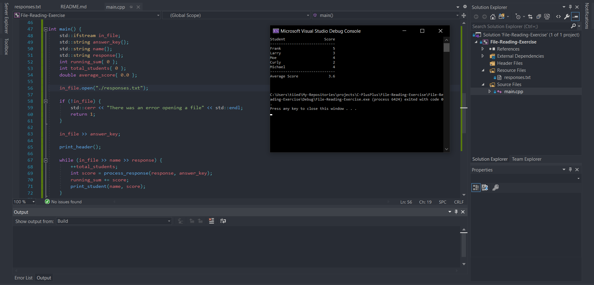

  

# TITLE
...

### Instructions
Automated Grader

Write a program that reads a file named 'responses.txt" that contains the answer key for a quiz
as well as student responses for the quiz.

The answer key is the first item in the file.
Student1 name
Student1 responses
Student2 name
Student2 responses
. . .

Here is a sample file.

ABCDE                  
Frank                     
ABCDE                  
Larry
ABCAC
Moe
BBCDE
Curly
BBAAE
Michael
BBCDE

You should read the file and display:
Each student's name and score (#correct out of 5)
At the end, the class average should be displayed
You may assume that the data in the file is properly formatted

Program should output to the console the following:
Student               Score 
----------------------------
Frank                     5
Larry                     3
Moe                       4
Curly                     2
Michael                   4
---------------------------
Average score           3.6